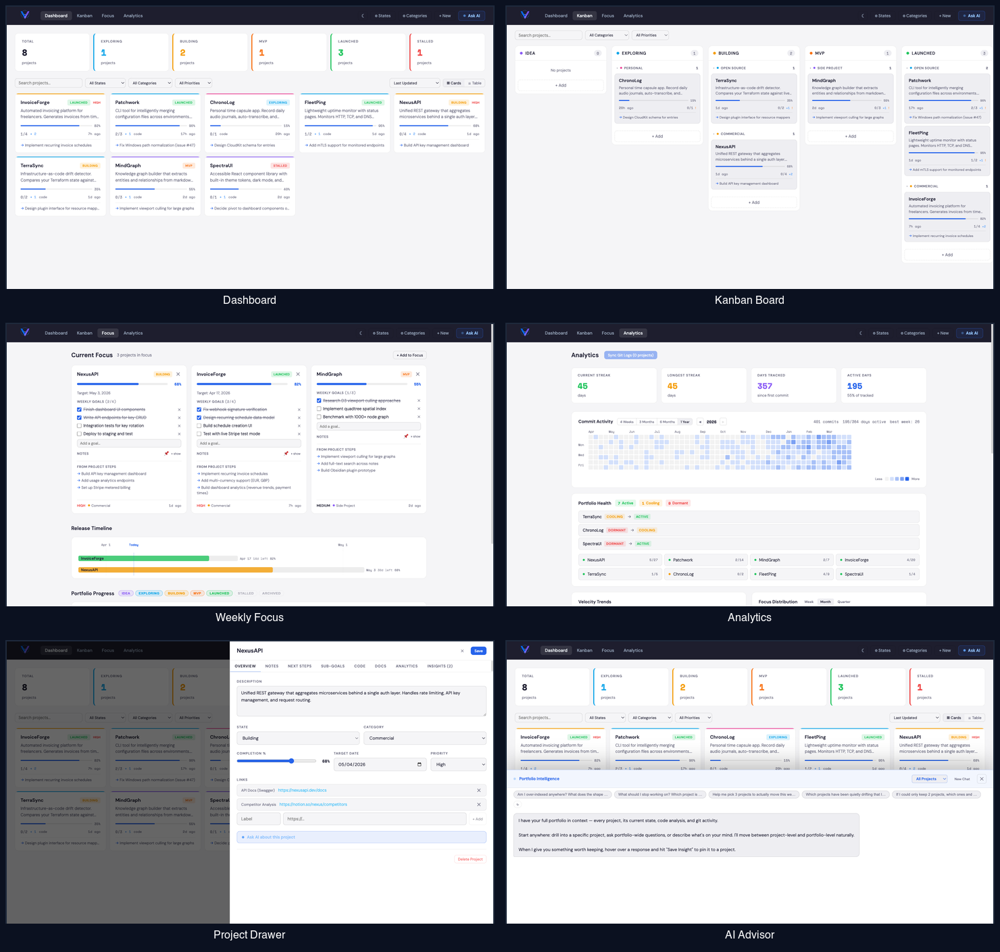

# [VibeFocus](https://vibefocus.ai)

**Portfolio intelligence for multi-project builders.**

Stop juggling projects. Start shipping what matters.

AI tools let you ship faster — but more projects mean more to track. VibeFocus gives you one unified view across everything you're building: completion tracking, health signals, code-aware insights, and clear answers to *"what needs my attention right now?"*

> Existing tools track tasks within a single project. None answer the fundamental question: **"Am I working on the right project?"**



---

## Features

### Portfolio Dashboard
See everything at a glance. Cards or table view, filter by state, category, or priority. Track projects across 7 lifecycle states (Idea → Launched) with completion percentages and next steps visible on every card.

### Kanban Board
Drag-and-drop projects across lifecycle states. Group by category. Visual progress bars, priority badges, and step counts at a glance.

### AI Portfolio Advisor
A code-aware AI that knows your entire portfolio — git history, code analysis, project health, saved insights from past sessions. Ask portfolio-wide questions like *"Which projects have been quietly drifting?"* or drill into a specific project. Saves insights back to project records.

### Weekly Focus
Pick 1–3 projects to commit to each week. Set checkboxed goals, track release timelines, and see a sortable progress table across your entire portfolio.

### Analytics
Commit activity heatmaps, velocity trends, focus distribution charts, portfolio health status, streak tracking, and stall alerts. Understand where your time actually goes.

### Code Analysis
Agent SDK reads your actual codebase — detects tech stacks, surfaces TODOs, estimates completion, and grades project health (active/cooling/dormant). AI advice is grounded in your code, not generic platitudes.

### MCP Server
32 tools across 8 categories for Claude Code, Claude Desktop, or any MCP-compatible client. Start coding sessions with full project context, mark steps done from chat, run weekly reviews, and check focus alignment — all without leaving your editor.

---

## Stack

| Layer | Tech |
|-------|------|
| Backend | Python 3.11+, FastAPI, SQLAlchemy, SQLite |
| Agent | Anthropic Agent SDK (local codebase analysis) |
| AI Chat | Anthropic Messages API (streaming SSE) |
| Frontend | Vite + React 18 + TypeScript |
| State | Zustand + TanStack Query |
| MCP | Python MCP server (stdio transport, 32 tools) |

---

## Quick Start

### Docker (easiest)

```bash
docker run -d -p 8000:8000 \
  -v ./data:/app/data \
  -v /path/to/your/projects:/path/to/your/projects:ro \
  -e ANTHROPIC_API_KEY=your_key_here \
  ericblue/vibefocus:latest
```

Open http://localhost:8000. The volume mount to your projects directory enables git sync, code analysis, and AI code exploration.

### From Source

```bash
git clone https://github.com/ericblue/vibefocus.git
cd vibefocus
make install                    # Install frontend + backend + MCP server
cp backend/.env.example backend/.env  # Add your ANTHROPIC_API_KEY
make run                        # Start app (backend :8000, frontend :5173)
```

Requires Python 3.12+, Node 18+, and an [Anthropic API key](https://platform.anthropic.com).

See **[INSTALL.md](INSTALL.md)** for detailed setup including custom ports, Docker Compose, and MCP server configuration.

---

## Project Structure

```
vibefocus/
├── backend/
│   ├── main.py              # FastAPI entry point
│   ├── database.py          # SQLite via SQLAlchemy
│   ├── models.py            # ORM models
│   ├── schemas.py           # Pydantic schemas
│   ├── routers/             # API routes (projects, buckets, states, analytics, chat)
│   └── services/
│       ├── agent_analyzer.py  # Agent SDK codebase analysis
│       ├── git_service.py     # Local git + GitHub API
│       └── chat_service.py    # Portfolio-context streaming chat
├── frontend/
│   └── src/
│       ├── App.tsx
│       ├── components/        # Dashboard, KanbanBoard, FocusView, Analytics, etc.
│       ├── hooks/             # TanStack Query hooks
│       ├── store/             # Zustand UI state
│       └── api/               # Typed fetch client
└── mcp-server/
    └── server.py              # 32-tool MCP server
```

---

## Roadmap

- [x] Search and filter across projects
- [x] Weekly Focus mode (pick 1–3 projects, set goals)
- [x] Project health scoring (active / cooling / dormant)
- [x] Drag-and-drop Kanban board
- [x] Analytics dashboard (heatmap, velocity, streaks, focus distribution)
- [x] MCP server (32 tools for Claude and AI assistants)
- [x] Code-aware AI analysis via Agent SDK
- [x] Persistent chat with portfolio context
- [ ] Export / import JSON backup
- [ ] Cloud-hosted version (VibeFocus Cloud)
- [ ] GitHub repo auto-link (pull open issues as next step candidates)
- [ ] Team portfolios and shared dashboards

---

## Who It's For

- **Solo founders** managing 5–15+ projects who need ruthless prioritization
- **Indie developers** juggling open source, side projects, and paid work
- **AI-era builders** using AI tools to prototype fast and needing to turn velocity into focused outcomes

---

## Contributing

Open source and welcomes contributions. Open an issue before submitting large PRs.

## License

MIT

---

**[vibefocus.ai](https://vibefocus.ai)** · Built by [Eric Blue](https://github.com/ericblue) · An [UpwardBit Ventures](https://github.com/UpwardBit) project
